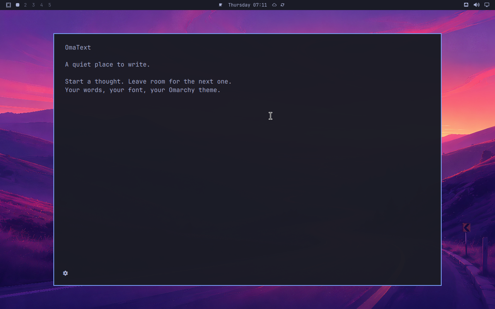

# OmaText

バーに置かない、Omarchy 4のシンプルなテキストエディタプラグイン。
通常のウィンドウで開き、`qs.Commons` / `qs.Ui`の色・フォント・ボタンを直接使います。



## ビルドとローカルインストール

必要: Omarchy 4、Qt 6のCore/Gui/Qml/Quick/QuickControls2/Test、CMake、C++17コンパイラ、Python 3。
Omarchy 4.0.3 / Quickshell 0.3.1 / Qt 6.11.2で動作確認しています。

```sh
git clone https://github.com/komagata/OmaText.git
cd OmaText
cmake -S . -B build
cmake --build build
ctest --test-dir build --output-on-failure
python3 scripts/install-local.py
```

インストーラはプラグインと説明ファイルをユーザーのプラグインフォルダへコピーします。
バーへの登録は行いません。アプリ一覧の「OmaText」から開けます。
C++バックエンドのビルドが必要なため、`omarchy plugin add`だけではインストールできません。

```sh
omarchy-shell shell summon io.github.komagata.omatext '{}'
```

## 操作

普段は左下の歯車だけを表示します。ホバーすると設定・新規・開く・保存の4アイコンが現れます。
設定モーダルで本文のフォントと文字サイズを選べます。✓で適用、×でキャンセル（ツールチップはApply / Cancel）。
選択中は本文にプレビューし、適用した設定は`~/.config/omatext/editor.ini`に保存します。
「Omarchy default」を選ぶとテーマのフォント・文字サイズに追従します。

- Ctrl+,: Settings（設定）
- Ctrl+N: New（新規）
- Ctrl+O: Open（開く）
- Ctrl+S: Save（保存）
- Ctrl+Shift+S: 名前を付けて保存
- Ctrl+Q / ウィンドウを閉じる: 未保存確認後に閉じる
- Ctrl+Z / Ctrl+Shift+Z: 元に戻す / やり直す
- Ctrl+A / Ctrl+C / Ctrl+X / Ctrl+V: 選択・コピー・切取り・貼付け

UTF-8の通常ファイル（2 MiB以下）を開きます。読み込んだCRLFとUTF-8 BOMは保存時に維持します。
保存はQSaveFileで原子的に行い、失敗時には本文と未保存状態を残します。
タブ、Markdownプレビュー、自動保存はありません。

プラグインはシェルと同じプロセスで動きます。ウィンドウを閉じても再表示のため状態を保持しますが、
シェルの再起動・プラグイン再読込／無効化・システム終了に備え、必要な本文はファイルへ保存してください。
ネイティブバックエンドを更新する場合は保存後に再ログインが必要です（共有ライブラリはプロセス中に残るため）。

## 更新

文書を保存して閉じ、プラグインを削除してから再ビルド・再インストールします。

```sh
omarchy plugin remove io.github.komagata.omatext
git pull --ff-only
cmake -S . -B build
cmake --build build
ctest --test-dir build --output-on-failure
python3 scripts/install-local.py
```

更新後は再ログインしてください。シェルが以前のQMLや共有ライブラリを保持する場合があります。

## 削除

文書を保存して閉じてから実行します。

```sh
omarchy plugin remove io.github.komagata.omatext
rm -- "${XDG_DATA_HOME:-$HOME/.local/share}/applications/io.github.komagata.omatext.desktop"
```

ユーザーが保存したテキストファイルと`~/.config/omatext/editor.ini`は削除しません。

## 構成

`ui/Editor.qml`がホストのopen/closeを受け、`ui/EditorView.qml`を表示します。
`src/document.*`はファイル処理と未保存確認の状態を担当するQt QMLモジュールです。
独立したQuickshellプロセスやバックグラウンドコマンドは起動しません。
`tests/support`のOmarchy部品の写しとテーマアダプタはヘッドレステスト専用で、インストールされません。

調査・設計と検証結果は[実装記録](docs/implementation.md)にまとめています。


## ライセンス・問い合わせ

[MIT License](LICENSE)。テスト用Omarchy部品のライセンスは[OMARCHY-LICENSE](tests/support/vendor/OMARCHY-LICENSE)を参照してください。
不具合や要望は[Issues](https://github.com/komagata/OmaText/issues)へどうぞ。
